```plantuml
@startuml
skinparam usecaseFontSize 14
skinparam usecaseStereotypeFontSize 12
skinparam hexagonFontSize 14
skinparam hexagonStereotypeFontSize 12
title "writing assistant flow"
footer

powered by spring-ai-alibaba
end footer
circle start<<input>> as __START__
circle stop as __END__
usecase "summarizer"<<Node>>
usecase "feedback_classifier"<<Node>>
usecase "reworder"<<Node>>
usecase "title_generator"<<Node>>
hexagon "check state" as condition1<<Condition>>
"__START__" -down-> "summarizer"
"summarizer" -down-> "feedback_classifier"
"feedback_classifier" .down.> "condition1"
"condition1" .down.> "summarizer": "negative"
'"feedback_classifier" .down.> "summarizer": "negative"
"condition1" .down.> "reworder": "positive"
'"feedback_classifier" .down.> "reworder": "positive"
"reworder" -down-> "title_generator"
"title_generator" -down-> "__END__"
@enduml
```

# ✍️ 智能写作助手 - Spring AI Graph Demo
本项目是一个基于 [Spring-AI-Graph](https://github.com/alibaba/spring-ai-alibaba/tree/main/spring-ai-alibaba-graph)
的智能写作工作流 Demo，具备自动生成摘要、改写内容、生成标题，并支持基于反馈循环的优化流程。

---
## 接口文档
### GraphController 接口

#### 1. mock 方法

**接口路径：** `GET /api/graph/mock/http`

**功能描述：** 提供 mock 相关功能

**主要特性：**
- 基于 Spring Boot REST API 实现
- 返回 JSON 格式响应
- 支持 UTF-8 编码

**使用场景：**
- 数据处理和响应
- API 集成测试

**示例请求：**
```bash
GET http://localhost:8080/api/graph/mock/http
```
## 技术实现
### 核心组件
- **Spring Boot**: 应用框架
- **Spring AI Alibaba**: AI 功能集成
- **REST Controller**: HTTP 接口处理
- **spring-boot-starter-web**: 核心依赖
- **spring-ai-alibaba-starter-dashscope**: 核心依赖
- **spring-ai-alibaba-graph-core**: 核心依赖

### 配置要点
- 需要配置 `AI_DASHSCOPE_API_KEY` 环境变量
- 默认端口：8080
- 默认上下文路径：/basic
## 测试指导
### 使用 HTTP 文件测试
模块根目录下提供了 **[workflow-writing-assistant.http](./workflow-writing-assistant.http)** 文件，包含所有接口的测试用例：
- 可在 IDE 中直接执行
- 支持参数自定义
- 提供默认示例参数

### 使用 curl 测试
```bash
# mock 接口测试
curl "http://localhost:8080/api/graph/mock/http"
```
## 注意事项
1. **环境变量**: 确保 `AI_DASHSCOPE_API_KEY` 已正确设置
2. **网络连接**: 需要能够访问阿里云 DashScope 服务
3. **字符编码**: 所有响应使用 UTF-8 编码，支持中文内容
4. **端口配置**: 确保端口 8080 未被占用

---

*此 README.md 由自动化工具生成于 2025-12-11 00:51:02*
## 模块说明
本项目是一个基于 [Spring-AI-Graph](https://github.com/alibaba/spring-ai-alibaba/tree/main/spring-ai-alibaba-graph)。

## 🚀 功能
- ✅ 输入原始文本，自动生成摘要
- ✅ 智能判断摘要是否让“用户”满意（通过大模型判断，后续可扩展为用户交互反馈判断）
- ✅ 不满意则自动回退重新生成摘要
- ✅ 摘要通过后自动进行语言优化 + 标题生成
- ✅ 完整流程基于有向图工作流，清晰可追溯
- ✅ 自动生成 PlantUML 流程图，便于可视化

---

## ⚙️ 环境配置


### 1. 添加依赖
```xml

<dependency>
    <groupId>com.alibaba.cloud.ai</groupId>
    <artifactId>spring-ai-alibaba-starter-dashscope</artifactId>
    <version>${spring-ai-alibaba.version}</version>
</dependency>
<dependency>
    <groupId>com.alibaba.cloud.ai</groupId>
    <artifactId>spring-ai-alibaba-graph-core</artifactId>
    <version>${spring-ai-alibaba-graph-core.version}</version>
</dependency>
```

### 2. 配置 API Key（application.yml）
```yaml
spring:
  ai:
    dashscope:
      api-key: ${AI_DASHSCOPE_API_KEY}
```

---

## ▶️ 快速启动
```bash

## 🧪 示例接口调用


### 请求接口
```
GET http://localhost:8080/write?text=今天我学习了spring-ai-alibaba-graph的相关概念，spring-ai-alibaba-graph做的特别好， 感觉特别开心
```

### 返回结果（JSON）
```json
{
  "summary": "今日学习了spring-ai-alibaba-graph的相关概念，对其优秀表现感到开心。",
  "summary_feedback": "positive",
  "reworded": "今日深入探索了spring-ai-alibaba-graph的相关概念，不禁为其卓越的表现而感到由衷欣喜。这一学习旅程不仅充实了我的知识库，更让我领略到这一技术的独特魅力与无限潜力。",
  "original_text": "今天我学习了spring-ai-alibaba-graph的相关概念，spring-ai-alibaba-graph做的特别好， 感觉特别开心",
  "title": "《深入探索Spring AI Alibaba Graph：一场技术魅力的发现之旅》"
}
```

---

## 📊 流程图 PlantUML（控制台自动打印）



---

*此 README.md 由自动化工具融合更新于 2025-12-11 00:41:58*

*融合策略：保留了原有的技术文档内容，并添加了自动生成的 API 文档部分*

---

*此 README.md 由自动化工具融合更新于 2025-12-11 00:51:02*

*融合策略：保留了原有的技术文档内容，并添加了自动生成的 API 文档部分*